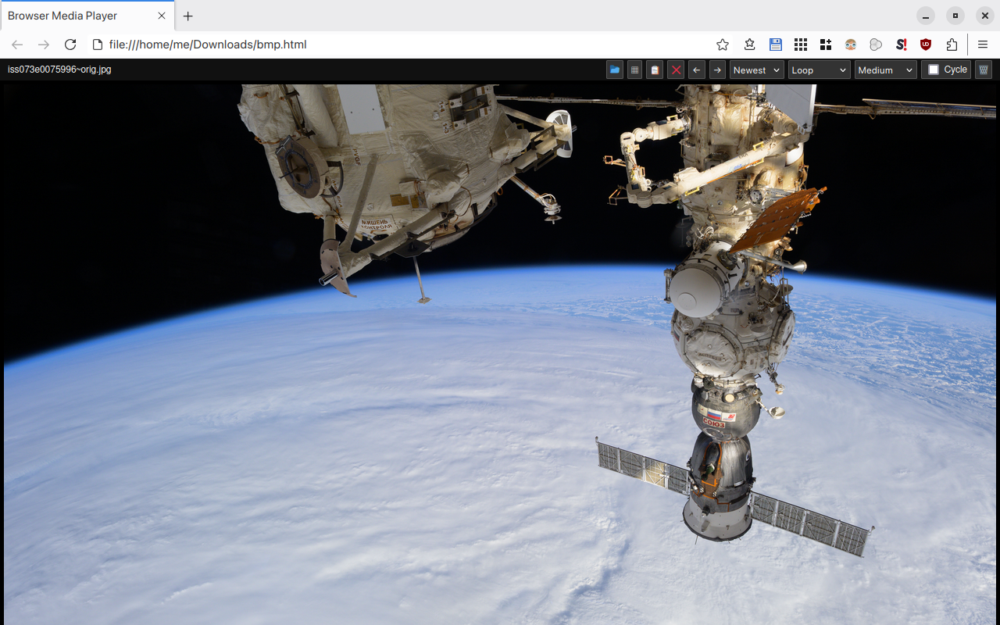
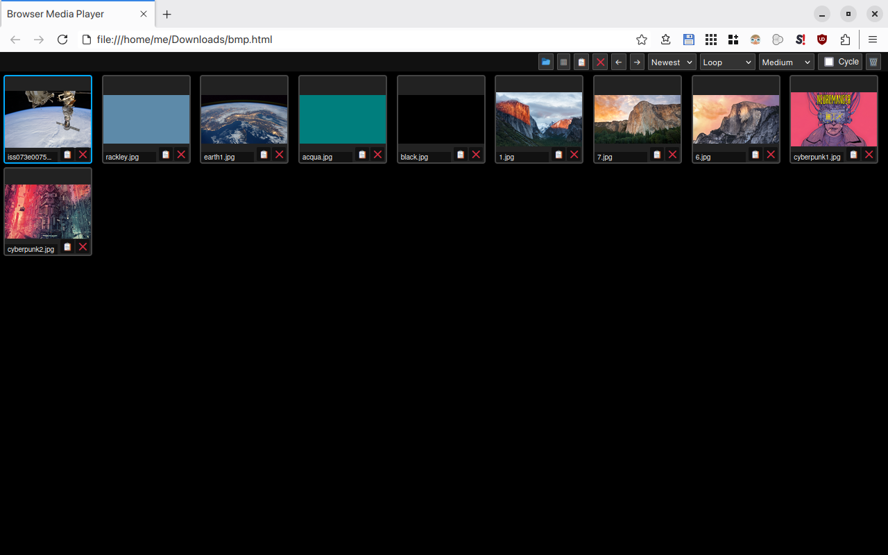

# BMP (Browser Media Player)

My bloated browser already has everything needed to play images, videos, and audio.  
So why should I install yet another piece of software with hundreds of megabytes of dependencies just to do that?

That’s why I made BMP (Browser Media Player): a simple player that works right in your browser.

Just select a local folder to instantly view its contents.

**Features:**
- Play videos, images, and audio files
- Browse media forward and backward
- Sort files by date or alphabetically
- Video playback with loop or auto-next modes
- Option to cycle through the media in the folder
- Zoom images with the mouse wheel
- "Grid" mode to display all files in the selected folder
- Thumbnails in grid mode (with persistent cache)
- Adjustable thumbnail sizes
- Option to clear thumbnail cache
- Remove files (requires a helper script)
- Copy file names

**Screenshots:**

**Limitations:**
Due to browser security restrictions, BMP has some limitations. For example, you can’t select a single file and then read the entire folder.  
Nor can you actually delete files from the browser directly.  
That’s why there’s a tiny Bash helper script for a few extra tasks (`bmphelper.sh`):

**Current helper functionality:**
- Remove files: When you press DELETE (or click “delete” in the GUI), BMP copies `bmp_cmd_delete:filename.ext` to your clipboard.  
  The `bmphelper.sh` script continuously monitors your clipboard, and if it finds this command, deletes the corresponding file.  
  You’ll need to keep `bmphelper.sh` running and point it at the folder you want to manage.

**Note:** BMP was developed around my personal needs and common use-cases.  
As a result, it may lack features that are important for other users or particular workflows.  
If you think BMP is a good idea, feel free to contribute!

Some limitations could technically be bypassed using APIs supported only by Chromium-based browsers,  
but for now I prefer to focus development on Firefox-based browsers.

**BMP was developed and tested primarily on Firefox, and may not work properly on other types of browsers.**
